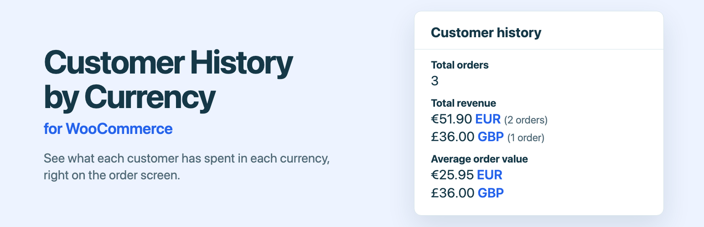
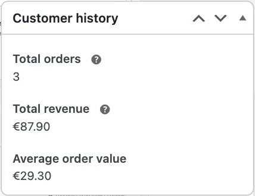
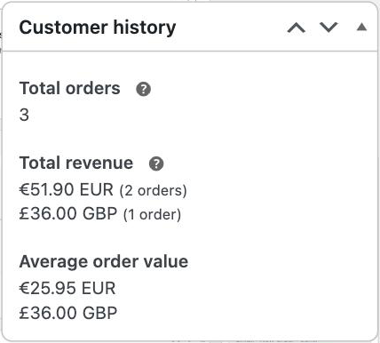
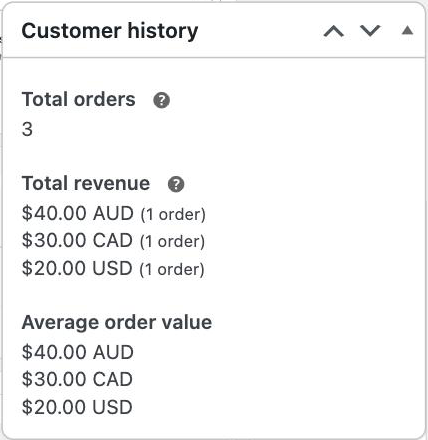

# Customer History by Currency for WooCommerce

See what each customer has spent in each currency, right on the WooCommerce order screen.

| WooCommerce alone | With this plugin |
| --- | --- |
|  |  |

## The problem

The **Customer history** box on the edit order screen adds up a customer's orders without reading each order's currency.

On a store that trades in euros, a customer with orders of €41.90, €10.00 and £36.00 shows a total of **€87.90**. Euros and pounds are added as if they were one unit, then labelled with the store's symbol. The average order value is worked out from the same sum. No exchange rate makes either number right.

This is [WooCommerce issue #43781](https://github.com/woocommerce/woocommerce/issues/43781), reported in January 2024. I reproduced it on WooCommerce 11.1.2.

## What the plugin does

It lists one total and one average per currency, each labelled with its currency code:

- **€51.90 EUR (2 orders)** and **£36.00 GBP (1 order)**, instead of €87.90.
- Refunds come off the total of the refunded order's own currency.
- Currencies that share a symbol stay distinct: `$40.00 AUD`, `$30.00 CAD` and `$20.00 USD`.
- Nothing is converted. Each amount is shown as the customer paid it.

It is built to stay out of the way:

- **It only acts when a customer has orders in another currency.** For everyone else, the box is byte for byte what WooCommerce renders.
- **It checks its own numbers.** If its per-currency counts and totals do not add up to the count and total WooCommerce calculated, it leaves the box alone.
- **It stands down if WooCommerce starts listing currencies itself.**
- There are no settings. It stores nothing, adds no database tables and makes no external requests.

## Who it helps

- **Store owners who sell in more than one currency,** whether through a multi-currency plugin or orders entered by hand.
- **Support and finance staff** who read this box before they refund, reply or flag an account.
- **Agencies and developers** who look after multi-currency stores and field the "why is this total wrong?" question.

## Requirements and limits

- WooCommerce 10.8 or later, with High-Performance Order Storage switched on. On legacy order storage the plugin changes nothing.
- WooCommerce Analytics enabled. WooCommerce only shows the Customer history box when it is.
- WordPress 6.9 or later and PHP 7.4 or later.
- Tested on WooCommerce 11.1.2 and 11.3.0-dev, with WordPress 7.1.2. It has not been tested against specific multi-currency plugins yet.
- If your theme replaces WooCommerce's `order/customer-history.php` template, the plugin only acts when that template still prints the standard total and average.

## Want this in WooCommerce itself?

This plugin exists so stores can have the fix now, without waiting on a change to WooCommerce core. If you would rather see it built in:

- Add a 👍 to [issue #43781](https://github.com/woocommerce/woocommerce/issues/43781).
- Follow the proposed core change in [pull request #69457](https://github.com/woocommerce/woocommerce/pull/69457).
- Or add your voice on the [WooCommerce feature requests board](https://woocommerce.com/feature-requests/woocommerce/).

## Install

1. Download the ZIP from this repository's releases.
2. In WordPress, go to **Plugins > Add Plugin > Upload Plugin** and upload it.
3. Activate **Customer History by Currency for WooCommerce**.
4. Open any order for a customer who has paid in more than one currency.

## Screenshots

| Three currencies that share the `$` symbol |
| --- |
|  |

## Development

The tests render WooCommerce's own Customer history box with the plugin active. They run inside a WooCommerce development checkout, using its PHPUnit and test helpers:

```sh
export WC_PLUGIN_DIR=/path/to/woocommerce/plugins/woocommerce
export WP_TESTS_DIR=/path/to/wordpress-tests-lib
"$WC_PLUGIN_DIR/vendor/bin/phpunit" -c phpunit.xml.dist
"$WC_PLUGIN_DIR/vendor/bin/phpcs" --standard=phpcs.xml.dist
```

Build the installable ZIP, which leaves out everything in `.distignore`:

```sh
bin/build-zip.sh
```

## Licence

GPL-2.0-or-later. See [LICENSE](LICENSE).
